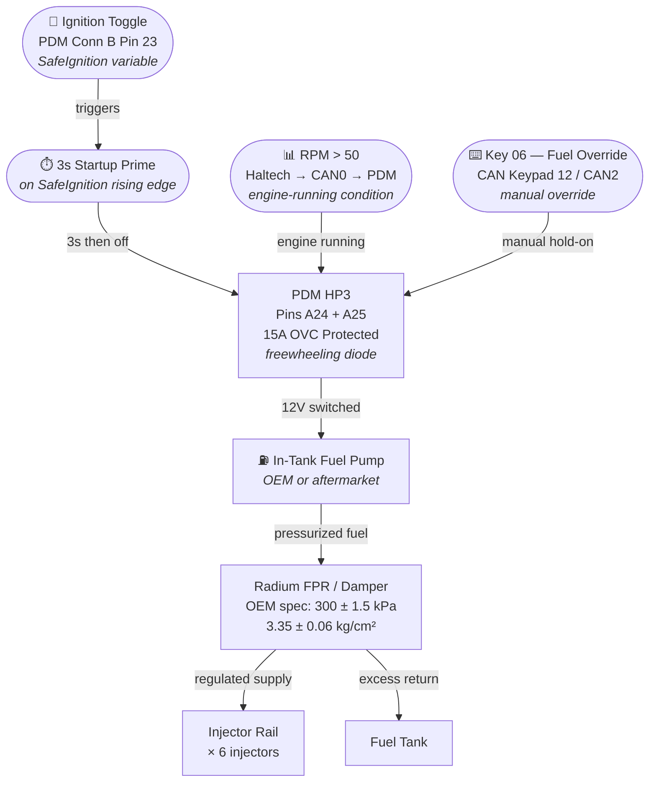
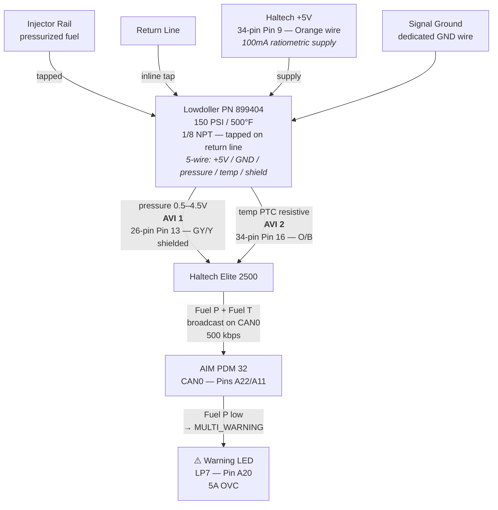

# Fuel Pump — White Tiburon Signal & Power Diagram
**Car:** White Tiburon | **ECU:** Haltech Elite 2500 | **PDM:** AIM PDM 32

Click any node to open the relevant knowledgebase file.

---

## Power & Control Path

---

## Sensor & Monitoring Path

---

## Reference Data

| Item | Value | Source |
|------|-------|--------|
| OEM fuel pressure (vac disconnected) | 330–350 kPa (47–50 psi) | `common/shop-manual/fuel-system.md` FLA-3 |
| OEM fuel pressure (vac connected) | ~270 kPa (~38 psi) | FLA-3 |
| Injector resistance | 13–16 Ω at 20°C | FLA-2 |
| Injector torque (delivery pipe bolt) | 10–15 Nm | FLA-4 |
| Sensor supply voltage | 5V DC / 100mA | Haltech 34-pin pin 9 |
| Sensor pressure output | 0.5–4.5V ratiometric | Lowdoller PN 899404 |
| AVI 1 pin (fuel pressure) | 26-pin pin 13 — GY/Y shielded | `build-knowledge-graph.json` |
| AVI 2 pin (fuel temp) | 34-pin pin 16 — O/B | `build-knowledge-graph.json` |
| PDM HP3 current limit | 15A OVC | `pdm-configuration-guide.md` |

---

## Related Files

| File | Contents |
|------|----------|
| [`hardware/aim-pdm/pdm-configuration-guide.md`](../../hardware/aim-pdm/pdm-configuration-guide.md) | HP3 trigger logic, fuel pump prime sequence |
| [`hardware/sensors/lowdoller-sensors.md`](../../hardware/sensors/lowdoller-sensors.md) | PN 899404 full specs, calibration tables |
| [`hardware/haltech/main-connector-26-pin-elite2500.md`](../../hardware/haltech/main-connector-26-pin-elite2500.md) | AVI 1 pin 13 details |
| [`hardware/haltech/main-connector-34-pin-elite2500.md`](../../hardware/haltech/main-connector-34-pin-elite2500.md) | AVI 2 pin 16, +5V pin 9 |
| [`common/shop-manual/fuel-system.md`](../../common/shop-manual/fuel-system.md) | FLA: OEM fuel pressure, injector specs, torques |
| [`build-knowledge-graph.json`](../build-knowledge-graph.json) | Machine-readable node graph for this car |
| [`signal-routing.md`](../signal-routing.md) | End-to-end signal routing table |
