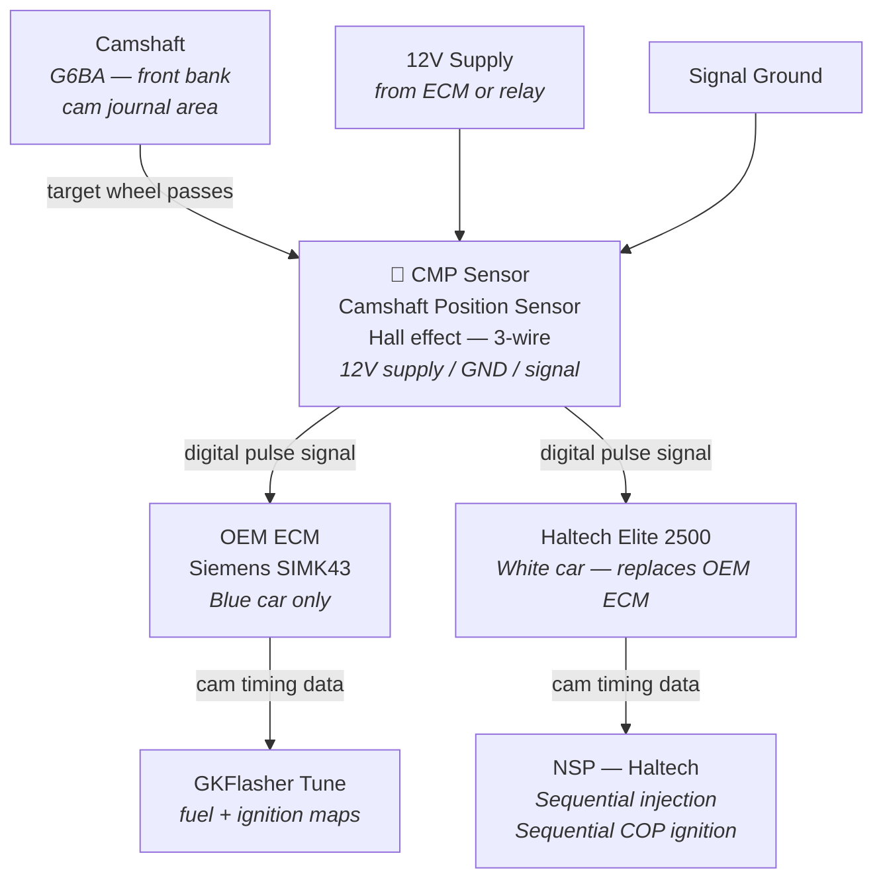
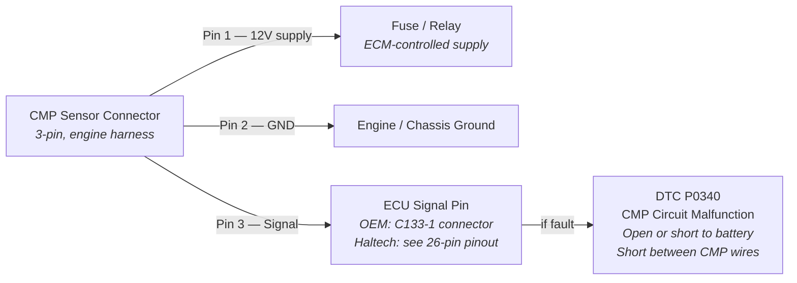

# Camshaft Position Sensor (CMP) — Component Diagram
**Applies to:** 2003 Hyundai Tiburon GK | 2.7L V6 Delta (G6BA) | Sensor type: Hall effect

Click any node to open the relevant knowledgebase file.

---

## Signal Path (OEM — Both Cars)

---

## Connector & Wiring Detail

---

## Cross-System References

```mermaid
flowchart TD
    CMP_NODE(["CMP Sensor<br/><b>comp-cmp-sensor</b>"])

    SPEC["Specs — FLA-2<br/>Type: Hall effect<br/>12V supply"]
    MFI["Role — FLA-20<br/>MFI control system<br/>cam phase reference"]
    DTC["DTCs — FLA-73<br/>P0340: Circuit Malfunction<br/>P0341: Range/Performance"]
    EC_SYS["Emission Control — EC<br/>System overview diagram"]
    ETM_LOC["ETM Component Locations<br/>CL section<br/><i>engine harness routing</i>"]
    OPENGK["OpenGK<br/>Replacement Part Numbers<br/>Compatible sensors"]
    FORUM["Forum — NewTiburon.com<br/><i>community-reviewed<br/>installation tips</i>"]

    CMP_NODE --> SPEC
    CMP_NODE --> MFI
    CMP_NODE --> DTC
    CMP_NODE --> EC_SYS
    CMP_NODE --> ETM_LOC
    CMP_NODE -.->|"community data"| OPENGK
    CMP_NODE -.->|"community-verified"| FORUM

    click SPEC "../../common/shop-manual/fuel-system.md" "FLA-2 sensor specifications"
    click MFI "../../common/shop-manual/fuel-system.md" "FLA-20 MFI control system"
    click DTC "../../common/shop-manual/fuel-system.md" "FLA-73 DTC P0340"
    click EC_SYS "../../common/shop-manual/emission-control-system.md" "EC chapter"
    click ETM_LOC "../../common/electrical-manual/component-locations.md" "ETM CL section"
    click OPENGK "../../common/opengk/sensor-information.md" "OpenGK sensor info"
```

---

## Reference Data

| Item | Value | Source |
|------|-------|--------|
| Sensor type | Hall effect | FLA-2 |
| OEM DTC | P0340 — CMP circuit malfunction | FLA-73 |
| Fault conditions | Open/short to battery between CMP and ECM; short between wires | FLA-73 |
| ECM connector | C133-1 | `common/opengk/ecm-pinouts.md` |
| Replacement sensor | See `common/opengk/sensor-information.md` | OpenGK |

---

## Related Files

| File | Contents |
|------|----------|
| [`common/shop-manual/fuel-system.md`](../shop-manual/fuel-system.md) | FLA-2 (specs), FLA-20 (MFI), FLA-73 (DTC P0340/P0341) |
| [`common/shop-manual/emission-control-system.md`](../shop-manual/emission-control-system.md) | EC chapter — system overview |
| [`common/electrical-manual/connector-configurations.md`](../electrical-manual/connector-configurations.md) | Engine harness connector codes |
| [`common/electrical-manual/component-locations.md`](../electrical-manual/component-locations.md) | Physical location on engine |
| [`common/opengk/ecm-pinouts.md`](../opengk/ecm-pinouts.md) | Siemens SIMK43 C133-1 connector |
| [`common/opengk/sensor-information.md`](../opengk/sensor-information.md) | Replacement part numbers |
| [`common/tiburon-knowledge-graph.json`](../tiburon-knowledge-graph.json) | Node: `comp-cmp-sensor` |
