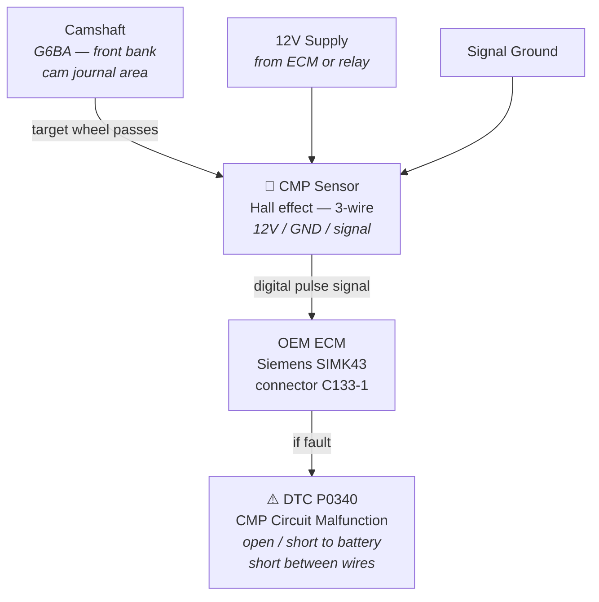

# LLM + Tiburon Knowledgebase — Demo for chase206

This is a quick demo showing what happens when you point an AI model at factory manual data instead of letting it guess.

---

## The Problem: AI Without Grounding

Ask a generic AI "what wire goes to the CMP sensor on a 2003 Tiburon V6?" and you get something like:

> *"The camshaft position sensor typically has three wires: power, ground, and signal. Check your factory service manual for exact pin numbers."*

Useless. It doesn't know which pin on the ECM, what connector code, or what the factory DTC is if it fails.

---

## The Same Question With the Knowledgebase

When the AI has access to the factory shop manual content and knowledge graph, the answer looks like this:

---

**Q: What are the connections for the CMP sensor on the G6BA V6, and what DTC trips if it fails?**

**A (grounded in factory data):**

The camshaft position sensor (CMP) on the G6BA is a 3-wire Hall effect sensor:

| Pin | Function | Notes |
|-----|----------|-------|
| 1 | 12V supply | ECM-controlled supply |
| 2 | Signal ground | Engine / chassis ground |
| 3 | Digital signal | Connects to ECM connector **C133-1** |

**ECM connector:** C133-1, pin documented in `common/opengk/ecm-pinouts.md`

**DTC if it fails:**
- **P0340** — CMP Circuit Malfunction. Triggers on: open circuit between CMP and ECM, short to battery, or short between wires.
- **P0341** — CMP Range/Performance (signal present but out of expected pattern).

**Source:** Factory Fuel System chapter, pages FLA-2 (sensor specs) and FLA-73 (DTC P0340 procedure). Sensor type confirmed Hall effect at FLA-2.

**Replacement sensors:** See `common/opengk/sensor-information.md` for compatible part numbers.

---

## And the Diagram

The knowledge graph also generates this clickable wiring diagram automatically:

Every node in the full diagram is clickable and goes to the relevant factory manual section.

---

## What This System Can Do

With the knowledgebase loaded via MCP (a protocol that gives the AI read access to the files), the AI can answer:

- **Specs:** "What's the valve spring free height limit on the G6BA?" → 41.5mm limit (FLA-3, factory table)
- **Torques:** "Torque for the cam sprocket bolt?" → 100 Nm (EMA-5 table)
- **Procedures:** "How do I test the TPS sensor?" → resistance values, voltage range, factory procedure page reference
- **Wiring:** "What connector code is the engine harness to ECM?" → C133-1, 26-pin, documented in ETM CL section
- **DTCs:** "What causes P0340?" → exact fault conditions from FLA-73
- **Part numbers:** "What COP coils fit the Tiburon?" → Toyota 90919-A2005, verified fit by community

It always cites the source. If it doesn't have a factory citation, it says so and flags the confidence level.

---

## The Setup

Zero cost to run. You just need:

1. Clone the repo (link below)
2. `npx @modelcontextprotocol/server-filesystem ./Knowledgebase`
3. Tell your Claude or other AI to use the `tiburon-kb` MCP server

Full setup instructions in `mcp/README.md`.

---

## Where You Come In

The factory manual data is already in. What we're missing is **community-verified data** that the factory manual doesn't cover:

- Compatible replacement part numbers (what sensors from other cars fit the G6BA)
- Race-prep procedures (alignment specs for track use, brake bias, etc.)
- Things you've found through hands-on experience that aren't in the book

When you add something, it comes in as `trust_level: "community_report"` and gets a GitHub Issue opened for community review. Once confirmed by multiple people, it moves up the trust ladder. Factory data always outranks community data, but the system shows both, clearly labeled.

Your posts on NewTiburon.com are already queued for ingestion — with your name attributed.

---

*Questions? Open a GitHub Issue or hit up the thread on NewTiburon.com.*
